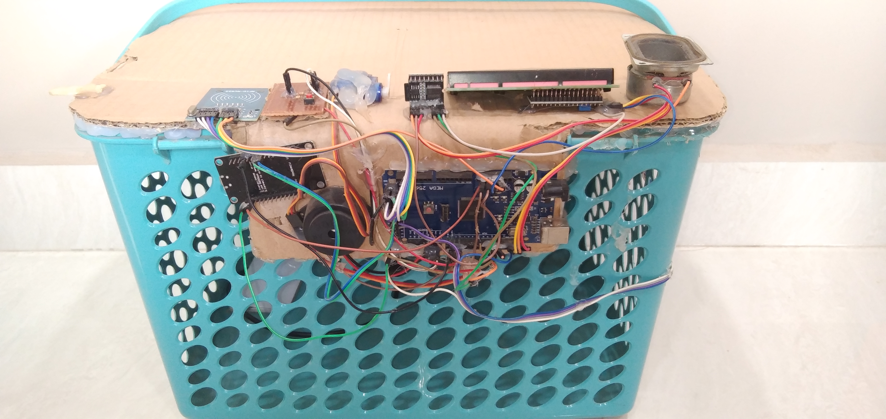

# Smart Cart for Automatic Billing and Assistance for Visually Impaired

## Introduction

The "Smart Cart for Automatic Billing and Assistance for Visually Impaired" is an innovative project aimed at automating the billing process in stores and providing assistance to visually impaired individuals. Traditional billing methods can be time-consuming, leading to long queues and inconvenience for customers. Additionally, visually impaired individuals often face challenges while shopping due to the lack of accessible technologies.

To address these issues, our project utilizes RFID technology to automatically scan products as they are placed in the cart. Along with this, the system includes an audio-based assistance feature to aid visually impaired users during their shopping experience. The final bill is displayed both on an LCD attached to the cart and sent to the billing computer via WiFi, ensuring a seamless and efficient checkout process.

## Components

The project consists of the following main components:

1. RFID Reader: Used to scan RFID tags attached to each product.

2. Node MCU: Acts as the brain of the cart, processing RFID data, and communicating with other modules.

3. Arduino Mega 2560: Responsible for controlling the overall system and handling input/output operations.

4. I2C Module: Facilitates communication between Arduino Mega 2560 and other modules.

5. Ultrasonic Sensor: Helps in detecting obstacles and ensures the cart's safety during navigation.

6. LCD Display: Shows the accumulated total bill to the shopper.

7. WLAN (WiFi): Enables communication between the cart and the billing computer.

## Functionality

### Automatic Billing Process

1. The user places products in the cart, each having an RFID tag.

2. As products are added, the RFID reader scans the RFID tags, and the Node MCU processes the data.

3. The Arduino Mega 2560 accumulates the total bill based on the scanned products.

4. The final bill amount is displayed on the LCD screen attached to the cart.

5. Simultaneously, the billing information is transmitted to the billing computer using WiFi.

### Assistance for Visually Impaired

1. The system provides audio-based assistance to visually impaired users through speakers or headphones.

2. Upon scanning each product, the cart informs the user about the product name and price audibly.

3. In case of any obstacles detected by the ultrasonic sensor, the cart alerts the user to avoid collisions.

## Setup and Usage

1. Clone or download the repository to your local machine.

2. Open the Arduino IDE and upload the necessary code to the Node MCU and Arduino Mega 2560.

3. Assemble the hardware components as described in the project documentation.

4. Power on the Smart Cart and ensure that the billing computer is connected to the same WiFi network.

5. Now, the cart is ready to be used for automatic billing and to provide assistance to visually impaired shoppers.

## Contribution

We welcome contributions to enhance the functionality, usability, and accessibility of the Smart Cart project. If you have any suggestions, bug fixes, or new features to add, please feel free to create a pull request.

## License

The Smart Cart project is licensed under the [MIT License](link_to_license).

## Acknowledgments

We would like to express our gratitude to [name of organization or individuals] for their support and guidance in developing this project.

---

By [Your Name]

For any inquiries, please contact [Your Email Address].
